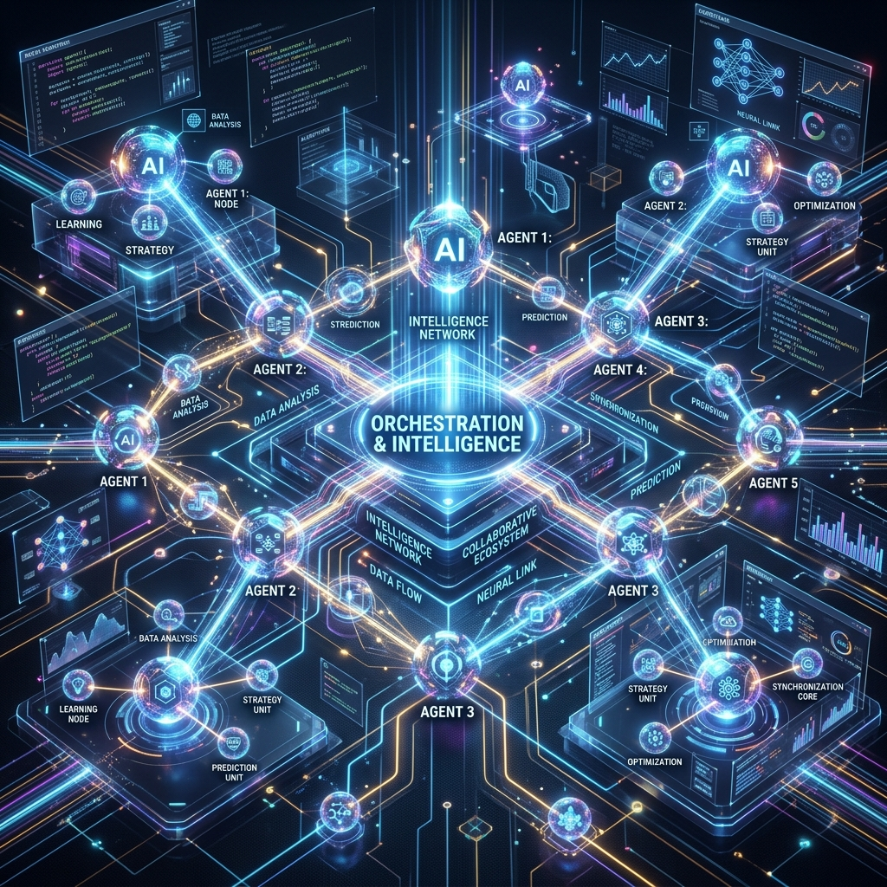

<b>This image was generated by Antigravity</b>

# Agent Frameworks

Frameworks and reference stacks for building agentic systems.

[Back to README](../../readme.md)

| Name        | Description                                                                                                                                                                         | URL                                             |
| ----------- | ----------------------------------------------------------------------------------------------------------------------------------------------------------------------------------- | ----------------------------------------------- |
| AutoGen     | AutoGen is a framework for creating multi-agent AI applications that can act autonomously or work alongside humans                                                                  | https://github.com/microsoft/autogen            |
| phidata     | Build multi-modal Agents with memory, knowledge, tools and reasoning. Chat with them using a beautiful Agent UI                                                                     | https://github.com/phidatahq/phidata            |
| Swarm       | Educational framework exploring ergonomic, lightweight multi-agent orchestration. Managed by OpenAI Solution team                                                                   | https://github.com/openai/swarm                 |
| crewAI      | Framework for orchestrating role-playing, autonomous AI agents. By fostering collaborative intelligence, CrewAI empowers agents to work together seamlessly, tackling complex tasks | https://github.com/crewAIInc/crewAI             |
| LangGraph   | Build resilient language agents as graphs                                                                                                                                           | https://github.com/langchain-ai/langgraph       |
| pydantic-ai | Agent Framework / shim to use Pydantic with LLMs                                                                                                                                    | https://github.com/pydantic/pydantic-ai         |
| DSPy        | The framework for programming—not prompting—language models                                                                                                                         | https://github.com/stanfordnlp/dspy             |
| smolagents  | smolagents: a barebones library for agents. Agents write python code to call tools and orchestrate other agents                                                                     | https://github.com/huggingface/smolagents       |
| eliza       | eliza is a simple, fast, and lightweight AI agent framework                                                                                                                         | https://github.com/elizaOS/eliza                |
| camel       | CAMEL: Finding the Scaling Law of Agents. The first and the best multi-agent framework.                                                                                             | https://github.com/camel-ai/camel               |
| AutoGPT     | AutoGPT is a powerful platform that allows you to create, deploy, and manage continuous AI agents that automate complex workflows.                                                  | https://github.com/Significant-Gravitas/AutoGPT |
| Anda        | 🤖 A framework for AI agent development, designed to build a highly composable, autonomous, and perpetually memorizing network of AI agents.                                        | https://github.com/ldclabs/anda                 |
| Mastra      | The TypeScript AI agent framework. ⚡ Assistants, RAG, observability. Supports any LLM: GPT-4, Claude, Gemini, Llama.                                                               | https://github.com/mastra-ai/mastra             |
| VoltAgent   | TypeScript AI AgentFramework Escape no-code limits and scratch-built overhead. Build, customize, and orchestrate AI agents with full control, speed, and a great DevEx.             | https://github.com/voltagent/voltagent/         |

## AI Agents Stack

https://ai-agents-stack.netlify.app/
