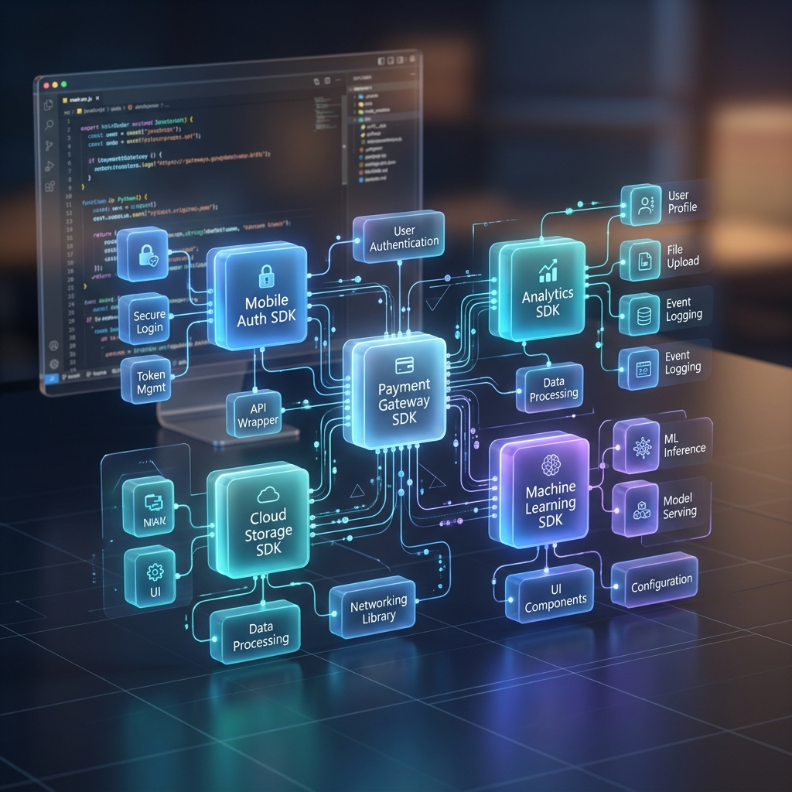

<b>This image was generated by Antigravity</b>

# Libraries

Libraries and SDKs for building LLM-powered products.

[Back to README](../../readme.md)

## bard-ai

A lightweight library to access Google Bard.  
https://github.com/EvanZhouDev/bard-ai

## autollm

Ship RAG based LLM web apps in seconds.  
https://github.com/safevideo/autollm

## Agents

An Open-source Framework for Autonomous Language Agents  
https://github.com/aiwaves-cn/agents

## kani (カニ)

kani (カニ) is a lightweight and highly hackable framework for chat-based language models with tool usage/function calling.  
https://github.com/zhudotexe/kani

## LangChain

Large language models (LLMs) are emerging as a transformative technology, enabling developers to build applications that they previously could not. But using these LLMs in isolation is often not enough to create a truly powerful app - the real power comes when you can combine them with other sources of computation or knowledge.  
https://github.com/hwchase17/langchain

## LLM Engine

The open source engine for fine-tuning and serving large language models.  
https://github.com/scaleapi/llm-engine

## ai-utils.js

TypeScript-first library for building AI apps, chatbots, and agents.  
https://github.com/lgrammel/ai-utils.js

## LangChain.js

Building applications with LLMs through composability  
https://github.com/hwchase17/langchainjs

## Chatbot UI

Chatbot UI is an advanced chatbot kit for OpenAI's chat models built on top of Chatbot UI Lite using Next.js, TypeScript, and Tailwind CSS.  
https://github.com/mckaywrigley/chatbot-ui

## LlamaIndex

LlamaIndex (GPT Index) is a project that provides a central interface to connect your LLM's with external data.  
https://github.com/jerryjliu/llama_index

## OpenChatKit

OpenChatKit provides a powerful, open-source base to create both specialized and general purpose chatbots for various applications.  
https://github.com/togethercomputer/OpenChatKit

## Vercel AI SDK

The Vercel AI SDK is a library for building edge-ready AI-powered streaming text and chat UIs.  
https://github.com/vercel-labs/ai
