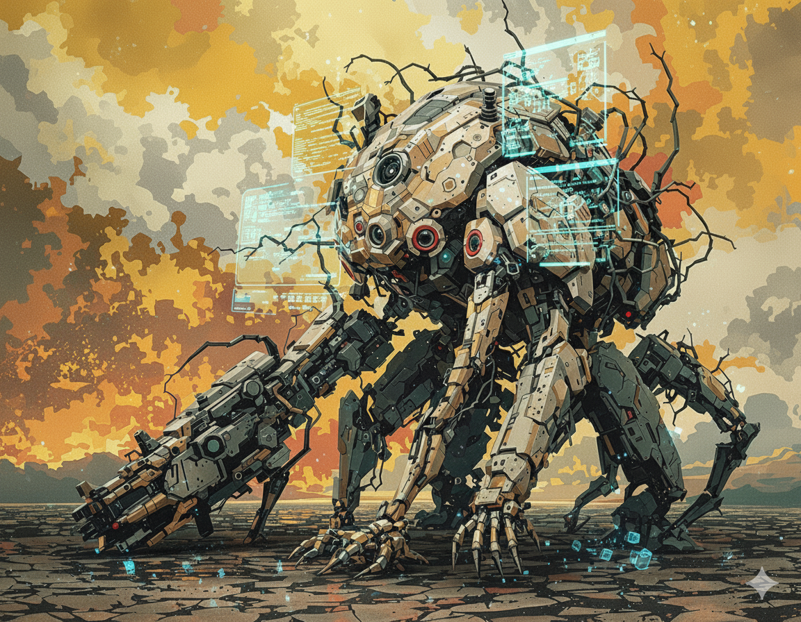

<b>This image was generated by Flux Pro v1.1 Ultra</b>

# ChatGPT | LLM | Prompt Engineering | Agents

Curated links for ChatGPT, LLMs, prompt engineering, agent frameworks, coding tools, libraries, and adjacent resources.

## Structure

- `readme.md`: entry point and category index.
- `docs/categories/`: category pages that hold the actual resource lists.
- `docs/templates/`: templates for adding new entries consistently.
- `docs/entries/`: optional detail pages when a resource needs more than a short entry.

## Categories

| Category | Contents | Page |
| --- | --- | --- |
| Applications | ChatGPT API apps, products, and experimental projects | [Applications](docs/categories/aplications/readme.md) |
| Prompt Engineering | Guides, prompt collections, and learning resources | [Prompt Engineering](docs/categories/prompt-engineering/readme.md) |
| Agent Frameworks | Agent libraries, orchestration frameworks, and reference stacks | [Agent Frameworks](docs/categories/agent-frameworks/readme.md) |
| Models | Closed models, open models, and small models | [Models](docs/categories/models/readme.md) |
| MCP | MCP directories and server catalogs | [MCP](docs/categories/mcp/readme.md) |
| IDE and CLI Tools | AI IDEs, coding CLIs, and free ChatGPT API links | [IDE and CLI Tools](docs/categories/ide-and-cli/readme.md) |
| Prototyping Tools | Fast interface and demo builders | [Prototyping Tools](docs/categories/prototyping/readme.md) |
| Libraries | SDKs and developer libraries | [Libraries](docs/categories/libraries/readme.md) |
| Desktop Applications | Desktop-native clients and apps | [Desktop Applications](docs/categories/desktop-applications/readme.md) |
| Tools | Search, observability, local model, and sharing tools | [Tools](docs/categories/tools/readme.md) |
| Other Resources | Miscellaneous repos, references, and adjacent projects | [Other Resources](docs/categories/other-resources/readme.md) |

## Adding New Resources

1. Pick the closest file in `docs/categories/`.
2. Add one resource in the same format already used in that category.
3. If an item needs longer notes, create a dedicated page under `docs/entries/` using the template in `docs/templates/entry-template.md` and link to it from the category page.
4. Keep category pages focused on discovery. Move long commentary into `docs/entries/` when the list starts getting hard to scan.

Detailed editing guidance lives in [docs/contributing.md](docs/contributing.md).

## Next Improvement

If this repository keeps growing, the next step is to move from manual Markdown curation to a structured source such as `data/entries.yml` plus a small script that generates the category pages.
