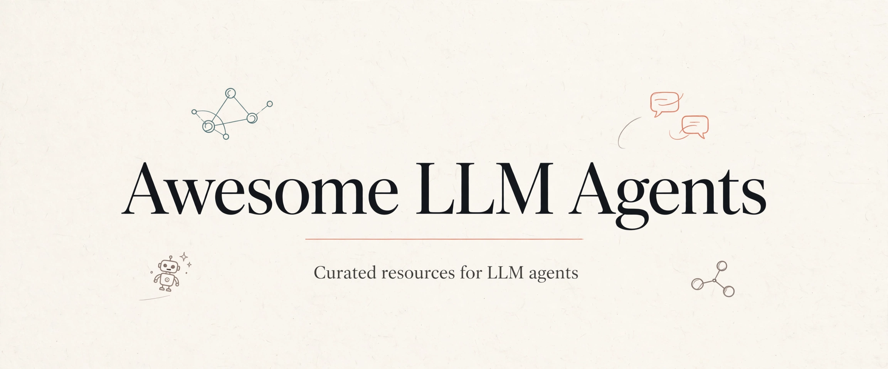

# Awesome LLM Agents

Curated links for ChatGPT, LLMs, prompt engineering, agent frameworks, coding tools, libraries, and adjacent resources.

**Browse it:** [koji.github.io/awesome-llm-agents](https://koji.github.io/awesome-llm-agents/) — searchable and filterable, organized by category.

## Structure

- `readme.md`: entry point and category index.
- `data/entries.yml`: source of truth for all resource entries.
- `scripts/generate.py`: regenerates category pages and builds the browse site (stdlib only).
- `docs/categories/`: category pages (generated — do not edit by hand).
- `docs/templates/`: templates for adding new entries consistently.
- `docs/entries/`: optional detail pages when a resource needs more than a short entry.
- `docs/data-schema.md`: schema reference for `data/entries.yml`.

## Categories

| Category | Contents | Page |
| --- | --- | --- |
| Agent Frameworks | Frameworks and reference stacks for building agentic systems. | [Agent Frameworks](docs/categories/agent-frameworks/readme.md) |
| Applications | Applications and end-user projects built around ChatGPT or adjacent LLM workflows. | [Applications](docs/categories/aplications/readme.md) |
| Desktop Applications | Desktop-native applications for LLM usage. | [Desktop Applications](docs/categories/desktop-applications/readme.md) |
| Hermes Agent | Hermes Agent and its ecosystem. | [Hermes Agent](docs/categories/hermes-agent/readme.md) |
| IDE and CLI Tools | Editor-first and terminal-first tools for AI-assisted coding workflows. | [IDE and CLI Tools](docs/categories/ide-and-cli/readme.md) |
| Libraries | Libraries and SDKs for building LLM-powered products. | [Libraries](docs/categories/libraries/readme.md) |
| MCP | Model Context Protocol resources and server indexes. | [MCP](docs/categories/mcp/readme.md) |
| Models | Model references grouped by availability and size. | [Models](docs/categories/models/readme.md) |
| OpenClaw | OpenClaw and its variants | [OpenClaw](docs/categories/openclaw/readme.md) |
| Other Resources | Miscellaneous repositories, references, and adjacent projects. | [Other Resources](docs/categories/other-resources/readme.md) |
| Prompt Engineering | Guides, prompt collections, and learning resources for prompt design. | [Prompt Engineering](docs/categories/prompt-engineering/readme.md) |
| Prototyping Tools | Rapid app-building tools for demos and lightweight AI interfaces. | [Prototyping Tools](docs/categories/prototyping/readme.md) |
| Skills | Agent skill collections for coding agents. | [Skills](docs/categories/skills/readme.md) |
| Tools | Supporting tools, platforms, and utilities around LLM workflows. | [Tools](docs/categories/tools/readme.md) |

## Adding New Resources

1. Add the resource to `data/entries.yml` (see `docs/data-schema.md` for the schema).
2. Run `python3 scripts/generate.py` to regenerate the category pages.
3. Commit `data/entries.yml` together with the regenerated pages.
4. If an item needs longer notes, create a dedicated page under `docs/entries/` using the template in `docs/templates/entry-template.md` and link to it from the entry's `url`.

Detailed editing guidance lives in [docs/contributing.md](docs/contributing.md).

## Browse Site

The browse site is built from `data/entries.yml` by `scripts/generate.py` (stdlib only) and deployed to GitHub Pages on every push to `main` (see `.github/workflows/pages.yml`).

Live: [koji.github.io/awesome-llm-agents](https://koji.github.io/awesome-llm-agents/)

<b>All images were generated by Nano Banana2</b>
